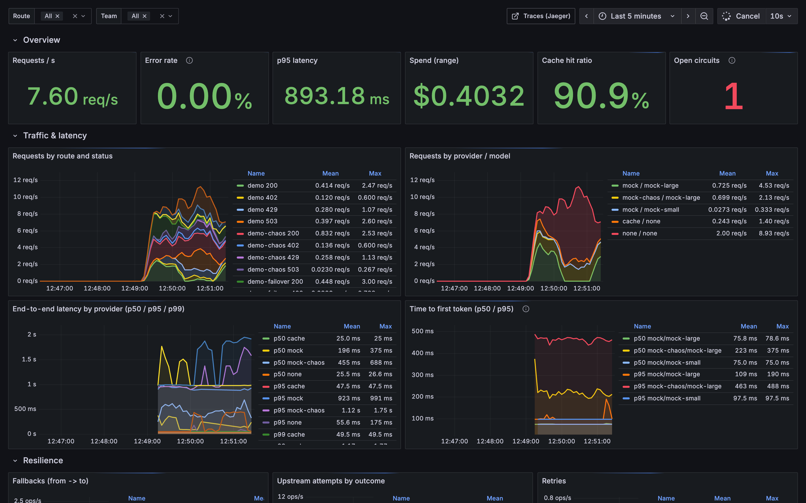
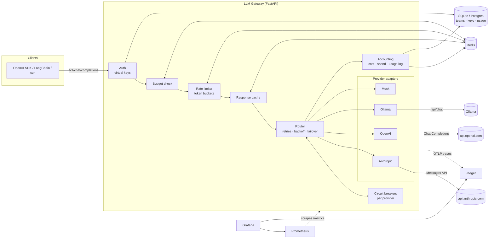
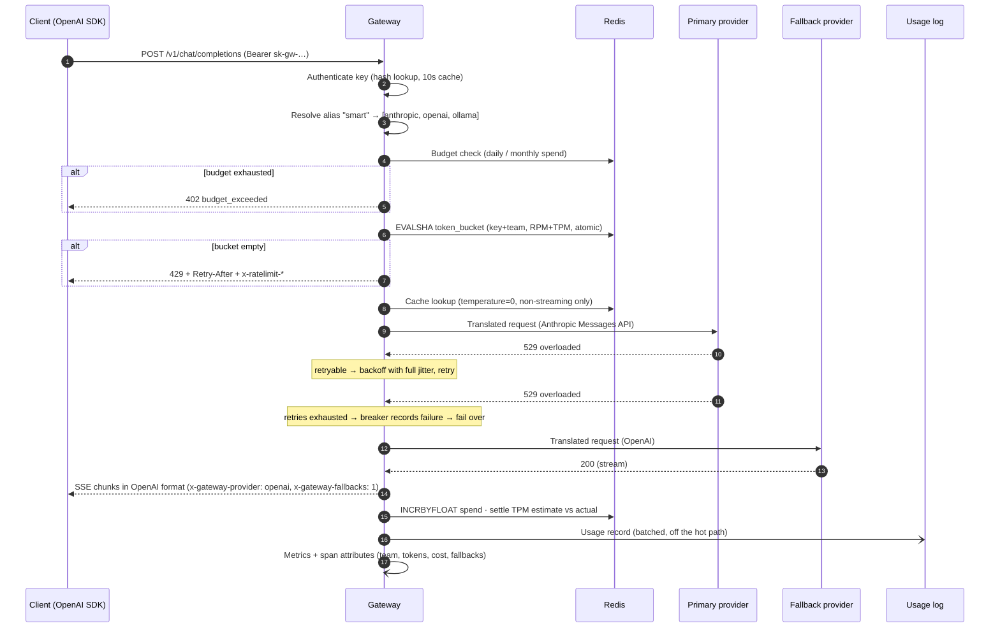
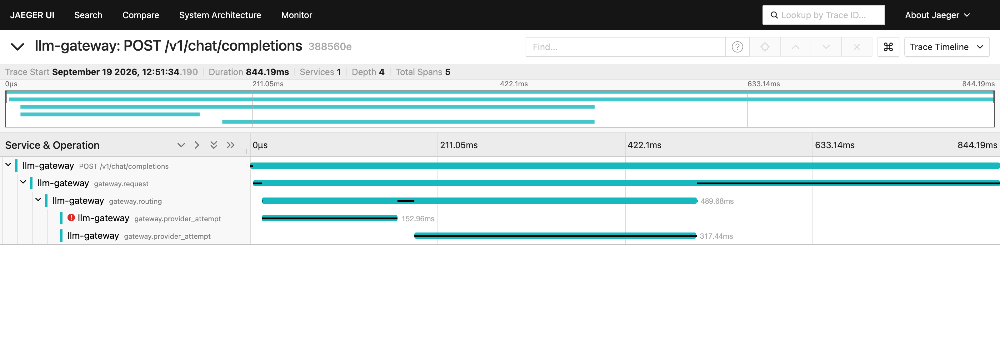

# LLM Gateway

**An OpenAI-compatible proxy that sits in front of every LLM call your organisation makes.** It routes each request through an ordered chain of providers (Anthropic, OpenAI, Ollama), retries and fails over when a provider has problems, enforces per-team budgets and rate limits, and records traces, metrics and a usage log along the way.

Point any OpenAI SDK at it by changing `base_url`. Teams get their own virtual API keys. Platform owners get cost attribution, a kill switch for runaway spend, and a Grafana dashboard that shows which provider served which team, at what latency and at what price.

[](https://github.com/aqkprogrammer/llm-gateway/actions/workflows/ci.yml)




---

## Highlights

| | |
|---|---|
| **OpenAI-compatible API** | `POST /v1/chat/completions` (streaming SSE and non-streaming) and `GET /v1/models`. Works with the official OpenAI SDKs, LangChain and anything else that speaks the OpenAI format. |
| **Real protocol translation** | Full request/response translation to the Anthropic Messages API and Ollama's native `/api/chat`. Covers system prompts, images, tools and tool calls, stop sequences, and streaming chunks (including tool-argument streaming). Token usage is mapped from every provider. |
| **Fallback routing** | YAML model aliases such as `smart → [anthropic:claude-sonnet-5, openai:gpt-4o, ollama:llama3.1]`, with per-route timeouts and retries. Backoff is exponential with full jitter and respects `Retry-After`. |
| **Circuit breakers** | One per provider (closed → open → half-open). Breaker state is exposed over HTTP, in Prometheus and in Grafana. |
| **Teams & virtual keys** | Keys are stored as SHA-256 hashes and belong to teams. An admin API (protected by a master key) manages teams, keys, budgets, limits and model allow-lists. |
| **Budgets** | Cost comes from a per-model pricing table. Daily and monthly budgets per team, with a soft-limit alert. Spend is tracked in Redis on the hot path, and Redis counters are rebuilt from the durable usage log if Redis loses them. |
| **Rate limits** | Requests-per-minute and tokens-per-minute token buckets per key and per team. One atomic Redis Lua script checks all of them. OpenAI-style `x-ratelimit-*` headers and `Retry-After`. |
| **Observability** | OpenTelemetry traces (request → routing → provider attempt → HTTP) exported over OTLP to Jaeger, 18 Prometheus metric families, a provisioned Grafana dashboard, and structured JSON logs that carry request and trace ids. |
| **Response cache** | Optional exact-match cache in Redis for deterministic (`temperature: 0`) non-streaming requests, scoped per team. |
| **Keyless demo mode** | A deterministic `mock` provider with configurable latency and failure injection, adjustable at runtime. Includes a load generator, so failover, circuit breakers and budgets can be demoed without any API keys. |

---

## Architecture



### Request lifecycle



---

## See it in action

These screenshots and outputs come from a local `make up` using the built-in mock providers, with no API keys. A chaos load test was running at the same time.

**1. Send a request through a fallback chain.** Create a team and a key with the admin API. Then call the `demo-failover` alias, whose primary provider always fails. Output from the real run:

```text
HTTP/1.1 200 OK
x-ratelimit-limit-requests: 600
x-ratelimit-remaining-requests: 599
x-gateway-route: demo-failover
x-gateway-provider: mock          <- served by the fallback provider
x-gateway-model: mock-large
x-gateway-fallbacks: 1            <- after the primary failed
x-gateway-attempts: 3             <- retries with backoff, then failover
x-gateway-cost-usd: 0.00078000    <- charged to the team's budget
```

**2. Use it from any OpenAI SDK.** Change `base_url` to point at the gateway, and routing, budgets, rate limits and failover all apply:

```python
from openai import OpenAI
client = OpenAI(base_url="http://localhost:8080/v1", api_key=KEY)  # a gateway virtual key
client.chat.completions.create(model="demo-failover", messages=[{"role": "user", "content": "Hi"}])
```

**3. Watch it under load.** `make loadgen ARGS="--duration 300 --chaos"` sends traffic from several demo teams and makes the `mock` provider fail for the middle third of the run. The pre-provisioned Grafana dashboard at the top of this README shows:

- **Traffic:** requests per second by route, status, provider and model.
- **Errors and latency:** the error rate, and p50/p95/p99 latency with time to first token.
- **Cost:** spend and the cache hit ratio.
- **Resilience:** circuit breakers opening and recovering, fallbacks and retries.
- **Budgets and limits:** teams reaching their budget (402) and their RPM limit (429).

**4. Trace every request.** Each request becomes an OpenTelemetry trace in Jaeger: request → routing → one span per provider attempt. The trace below shows a real fallback. The first `provider_attempt` failed (red), and the second one served the response.



## Quickstart

### Option A: the full stack in Docker (no API keys required)

```bash
cp .env.example .env            # optional: add ANTHROPIC_API_KEY / OPENAI_API_KEY
make up                         # gateway, redis, prometheus, grafana, jaeger
```

| Service | URL | Notes |
|---|---|---|
| Gateway | http://localhost:8080 | OpenAPI docs at `/docs` |
| Grafana | http://localhost:3000 | Anonymous viewer access; admin login `admin` / `admin`. The **LLM Gateway** dashboard is the home page. |
| Prometheus | http://localhost:9090 | Scrapes the gateway every 5s |
| Jaeger | http://localhost:16686 | Service `llm-gateway` |

If a port is already taken, override it: `GATEWAY_HOST_PORT=18080 GRAFANA_PORT=13000 make up` (see `.env.example`).

Create a team and a key, then send a request:

```bash
export MASTER="sk-master-change-me"   # GATEWAY_MASTER_KEY

TEAM_ID=$(curl -s localhost:8080/admin/teams -H "Authorization: Bearer $MASTER" \
  -H 'content-type: application/json' \
  -d '{"name": "search", "monthly_budget_usd": 50, "rpm_limit": 600}' | jq -r .id)

export KEY=$(curl -s localhost:8080/admin/keys -H "Authorization: Bearer $MASTER" \
  -H 'content-type: application/json' \
  -d "{\"team_id\": \"$TEAM_ID\", \"name\": \"backend\"}" | jq -r .key)

curl -s localhost:8080/v1/chat/completions -H "Authorization: Bearer $KEY" \
  -H 'content-type: application/json' \
  -d '{"model": "demo-failover", "messages": [{"role": "user", "content": "Hello!"}]}' -i
```

The response headers show what happened during routing:

```
x-gateway-route: demo-failover
x-gateway-provider: mock           # served by the fallback…
x-gateway-fallbacks: 1             # …after the primary failed
x-gateway-attempts: 4
x-gateway-cost-usd: 0.00078300
x-ratelimit-limit-requests: 600
x-ratelimit-remaining-requests: 599
x-request-id: req_…
```

Then generate traffic and open Grafana:

```bash
make loadgen ARGS="--duration 300 --chaos"
```

The `--chaos` flag makes the `mock` provider fail for the middle third of the run. On the dashboard you can watch its circuit open, fail fast, go half-open and close again when it recovers. At the same time the `research` demo team hits its soft-limit alert and then its budget (402s), and `growth` runs into its RPM limit (429s).

`make down` stops everything and removes the volumes.

### Option B: run locally

```bash
make install                    # uv sync (uv downloads Python 3.12 if needed)
docker run -d -p 6379:6379 redis:7.4-alpine
cp .env.example .env
make dev                        # http://localhost:8080 with auto-reload
make test                       # offline test suite (fakeredis, respx)
```

---

## Using it with the OpenAI SDK

```python
from openai import OpenAI

client = OpenAI(base_url="http://localhost:8080/v1", api_key="sk-gw-…")  # a gateway key

# Non-streaming, via an alias with a fallback chain
resp = client.chat.completions.create(
    model="smart",
    messages=[
        {"role": "system", "content": "You are terse."},
        {"role": "user", "content": "Explain circuit breakers in one sentence."},
    ],
)
print(resp.choices[0].message.content, resp.usage)

# Streaming, with usage in the final chunk
stream = client.chat.completions.create(
    model="smart",
    messages=[{"role": "user", "content": "Count to five."}],
    stream=True,
    stream_options={"include_usage": True},
)
for chunk in stream:
    if chunk.choices and chunk.choices[0].delta.content:
        print(chunk.choices[0].delta.content, end="", flush=True)

# Inspect the routing decision
raw = client.chat.completions.with_raw_response.create(
    model="smart", messages=[{"role": "user", "content": "hi"}]
)
print(raw.headers["x-gateway-provider"], raw.headers["x-gateway-fallbacks"])

# Address a provider directly (bypassing aliases)
client.chat.completions.create(model="anthropic:claude-opus-5", messages=[...])
```

Tool calling works the same as with OpenAI. Tool definitions, `tool_choice` and `tool_calls` are translated to Anthropic `tool_use`/`tool_result` blocks and back, and streamed tool arguments arrive as standard `delta.tool_calls` fragments.

---

## Configuration

### Environment (`GATEWAY_*`)

| Variable | Default | Description |
|---|---|---|
| `GATEWAY_MASTER_KEY` | *(unset → admin API disabled)* | Bearer token for `/admin/*` |
| `GATEWAY_CONFIG_PATH` | `config/gateway.yaml` | Routing configuration file |
| `GATEWAY_DATABASE_URL` | `sqlite+aiosqlite:///./data/gateway.db` | Any SQLAlchemy async URL, e.g. `postgresql+asyncpg://…` (`uv sync --extra postgres`) |
| `GATEWAY_REDIS_URL` | `redis://localhost:6379/0` | Rate limits, spend counters, cache |
| `GATEWAY_REDIS_FAIL_OPEN` | `true` | If Redis is down, keep serving and skip limits instead of failing every request |
| `GATEWAY_KEY_CACHE_TTL_S` | `10` | In-process cache for authenticated keys |
| `GATEWAY_OTEL_ENABLED` | `false` | Export traces over OTLP/HTTP |
| `GATEWAY_OTEL_EXPORTER_OTLP_ENDPOINT` | `http://localhost:4318` | Jaeger, Tempo, or an OTel Collector |
| `GATEWAY_LOG_LEVEL` / `GATEWAY_LOG_JSON` | `INFO` / `true` | Structured logging |
| `ANTHROPIC_API_KEY`, `OPENAI_API_KEY`, `OLLAMA_ENABLED`, `OLLAMA_BASE_URL` | empty | Referenced from the YAML. A provider with no key is disabled and skipped. |

### Routing (`config/gateway.yaml`)

`${VAR}` and `${VAR:-default}` are expanded from the environment at startup.

```yaml
providers:
  anthropic:
    type: anthropic                       # openai | anthropic | ollama | mock
    api_key: ${ANTHROPIC_API_KEY}
    unsupported_params: [temperature, top_p]   # stripped before sending
    default_max_tokens: 4096              # Anthropic requires max_tokens
    models: [claude-sonnet-5, claude-opus-5]   # advertised on /v1/models
  openai:
    type: openai
    api_key: ${OPENAI_API_KEY}
  ollama:
    type: ollama
    enabled: ${OLLAMA_ENABLED:-false}
    base_url: ${OLLAMA_BASE_URL:-http://localhost:11434}
  mock-flaky:                             # keyless, for demos and tests
    type: mock
    latency_ms: 30
    failure_rate: 1.0                     # 0..1, adjustable at runtime
    failure_status: 503
    failure_mode: error                   # or "timeout"

routes:
  smart:
    targets: [anthropic:claude-sonnet-5, openai:gpt-4o, ollama:llama3.1]
    timeout_s: 60                         # per attempt (time to first chunk for streams)
    max_retries: 2                        # per target, on 429/5xx/timeouts
    backoff_base_s: 0.25                  # full jitter: rand(0, min(max, base·2^n))
    backoff_max_s: 4.0

allow_direct_routing: true                # also accept "provider:model"
direct_route_defaults: { timeout_s: 60, max_retries: 1 }

circuit_breaker:
  failure_threshold: 5                    # consecutive failures before opening
  recovery_timeout_s: 20                  # open → half-open
  half_open_max_requests: 1               # concurrent probes while half-open
  success_threshold: 1                    # probe successes needed to close

cache: { enabled: true, ttl_s: 600 }

pricing:                                  # USD per 1M tokens; "provider:model" wins over "model"
  claude-sonnet-5: { input: 2.00, output: 10.00 }
  gpt-4o:          { input: 2.50, output: 10.00 }
```

#### Error classification

| Upstream result | Retry same provider? | Fail over? | Counts against breaker? |
|---|---|---|---|
| 408, 409, 429, 5xx, 529, timeout, connection error | yes (backoff) | yes, after retries | yes |
| 401, 402, 403, 404 (our credentials or model mapping are wrong) | no | yes | no |
| 400, 413, 422 (the payload is wrong) | no | **no**: returned to the client | no |
| `Retry-After` longer than `backoff_max_s` | no | yes, immediately | yes |

---

## Admin API

All admin endpoints require `Authorization: Bearer $GATEWAY_MASTER_KEY`. Interactive docs are at `/docs`.

| Method | Path | Purpose |
|---|---|---|
| `POST` | `/admin/teams` | Create a team: `name`, `daily_budget_usd`, `monthly_budget_usd`, `soft_limit_pct`, `rpm_limit`, `tpm_limit`, `allowed_models` |
| `GET` | `/admin/teams` | List teams |
| `GET` | `/admin/teams/{id}` | Team details, including current daily and monthly spend |
| `PATCH` | `/admin/teams/{id}` | Change budgets and limits, disable a team (`is_active: false`), `null` clears a limit |
| `POST` | `/admin/keys` | Create a key: `team_id`, `name`, optional `rpm_limit`, `tpm_limit`, `allowed_models`, `expires_in_days`. **The secret is returned once.** |
| `GET` | `/admin/keys?team_id=` | List keys (prefix only, never the secret) |
| `DELETE` | `/admin/keys/{id}` | Revoke a key |
| `GET` | `/admin/usage?team_id=&days=30` | Usage and cost by team, provider and model, from the persisted log |
| `GET` | `/admin/providers` | Provider status and circuit-breaker state |
| `POST` | `/admin/providers/{name}/reset` | Force a circuit closed |
| `PATCH` | `/admin/providers/{name}` | Chaos controls for `mock` providers (`failure_rate`, `failure_status`, `failure_mode`, `latency_ms`) |

Public endpoints: `/health/live`, `/health/ready` (checks Redis and the database), `/health/providers`, and `/metrics`.

### Error responses

Every error uses the OpenAI envelope `{"error": {"message", "type", "param", "code"}}`, so SDKs raise their usual typed exceptions:

| Status | `type` / `code` | When |
|---|---|---|
| 401 | `authentication_error` / `invalid_api_key` | Missing, unknown, revoked or expired key |
| 402 | `budget_exceeded` / `daily_budget_exceeded` · `monthly_budget_exceeded` | Team budget exhausted. `x-gateway-budget-reset` says when it resets. |
| 403 | `permission_error` / `model_not_allowed` | Model outside the key's or team's allow-list |
| 404 | `invalid_request_error` / `model_not_found` | Unknown alias or provider |
| 429 | `rate_limit_error` / `rate_limit_exceeded` | Token bucket empty (`Retry-After`, `x-ratelimit-*`) |
| 503 | `api_error` / `all_providers_failed` | Every target failed or had an open circuit |

---

## Metrics

All series are prefixed `llm_gateway_`.

| Metric | Type | Labels |
|---|---|---|
| `requests_total` | counter | `route`, `provider`, `model`, `status`, `stream` |
| `request_duration_seconds` | histogram | `route`, `provider`, `model`, `status` |
| `time_to_first_token_seconds` | histogram | `provider`, `model` |
| `provider_attempts_total` | counter | `provider`, `model`, `outcome` (`success`, `server_error`, `rate_limited`, `timeout`, `circuit_open`, …) |
| `provider_attempt_duration_seconds` | histogram | `provider`, `model`, `outcome` |
| `retries_total` | counter | `provider`, `model` |
| `fallbacks_total` | counter | `route`, `from_provider`, `to_provider`, `reason` |
| `tokens_total` | counter | `team`, `provider`, `model`, `type` (`prompt` / `completion`) |
| `cost_usd_total` | counter | `team`, `provider`, `model` |
| `circuit_breaker_state` | gauge | `provider` (0 closed, 1 open, 2 half-open) |
| `circuit_breaker_transitions_total` | counter | `provider`, `to_state` |
| `rate_limit_rejections_total` | counter | `team`, `scope` (`key` / `team`), `limit` (`requests` / `tokens`) |
| `budget_rejections_total` | counter | `team`, `period` |
| `budget_soft_limit_alerts_total` | counter | `team`, `period` |
| `budget_utilization_ratio` | gauge | `team`, `period` |
| `cache_requests_total` | counter | `result` (`hit` / `miss`) |
| `in_flight_requests` | gauge | |
| `auth_failures_total` | counter | `reason` |

The Grafana dashboard ([`deploy/grafana/dashboards/llm-gateway.json`](deploy/grafana/dashboards/llm-gateway.json)) is generated from [`scripts/build_dashboard.py`](scripts/build_dashboard.py), so it can be reviewed as code (`make dashboard`). It has five rows:

- **Overview:** request rate, error rate, p95 latency, spend, cache hit ratio, open circuits
- **Traffic & latency:** requests by route and status, requests by provider and model, p50/p95/p99 latency, time to first token
- **Resilience:** fallbacks (from → to), attempts by outcome, retries, a circuit-breaker state timeline, circuit transitions
- **Tokens & cost:** tokens/s by model, spend rate by team, budget utilisation, a spend table by team and model
- **Guardrails:** rate-limit rejections, budget rejections and alerts, in-flight requests, auth failures

### Traces

Each chat completion produces one trace:

```
POST /v1/chat/completions                       (FastAPI server span)
└── gateway.request                             team, route, tokens, cost_usd, fallback_count, cache_hit
    └── gateway.routing                         targets, served provider, attempt_count
        ├── gateway.provider_attempt            provider, model, attempt, outcome=server_error
        ├── gateway.provider_attempt            provider, model, attempt, outcome=success
        │   └── POST https://api.openai.com/…   (httpx client span)
```

Attribute names follow the OpenTelemetry GenAI semantic conventions where they exist (`gen_ai.request.model`, `gen_ai.usage.input_tokens`, …). Log lines include `request_id` and `trace_id`, so a log entry can be matched to its trace in Jaeger.

---

## Design decisions & trade-offs

- **OpenAI format as the canonical wire format.** Most client tooling already speaks it. Providers translate into and out of a small internal model (`ChatResult`, `StreamEvent`), so adding a provider means writing one adapter, with no changes to the router.
- **Streams can fail over only before the first byte.** The router waits for the first upstream event inside the timeout and only then commits to that provider and sends headers. Once tokens have reached the client, switching providers would produce a spliced response, so later failures are sent in-band as an OpenAI-style `error` chunk, which the SDKs turn into an exception.
- **One Lua script for every rate-limit bucket.** Key and team RPM/TPM buckets are checked and debited atomically. A request rejected by the team TPM bucket does not use up a slot in the key RPM bucket, and concurrent replicas cannot race. The script uses Redis server time, so clock skew between replicas does not matter.
- **TPM is enforced in two phases.** Real token counts are only known after the response, so admission debits an estimate (prompt characters / 4) and settlement charges or refunds the difference. Buckets are allowed to go negative, which throttles the requests that follow instead of rejecting the one that caused the overshoot. A request larger than the whole bucket is admitted when the bucket is full; otherwise it could never be served.
- **Budgets are checked before the request, not reserved.** A team is blocked once it has reached its limit. Requests already in flight finish, so overshoot is bounded by the team's concurrency. Reserving worst-case cost (`max_tokens × price`) up front would be exact, but it rejects legitimate traffic and complicates streaming.
- **Redis is the hot path; the database is the source of truth.** Spend counters are `INCRBYFLOAT` on per-period keys. When a key is missing (restart, eviction, new period) it is rebuilt from `usage_records` with `SET NX`, so flushing Redis cannot reset a team's budget. A test covers this.
- **Usage writes are batched off the hot path.** Records go onto an in-process queue and are flushed every second. A crash can lose up to one second of usage log; Redis spend is already updated by then.
- **Fail open on Redis outages (configurable).** Losing Redis disables rate limits and budget checks but not inference. Set `GATEWAY_REDIS_FAIL_OPEN=false` if strict enforcement matters more than availability.
- **Circuit breakers are per replica and in-process.** They react immediately and need no coordination. Each replica finds a bad upstream after `failure_threshold` failures, which is usually cheaper than coordinating breaker state through Redis. Only upstream-health failures count; a 400 caused by the client never opens a circuit.
- **Keys are stored as unsalted SHA-256.** Keys are 256-bit random tokens, so there is no dictionary to protect against, and lookups have to be O(1). The plaintext is shown once, at creation. Positive lookups are cached for 10 seconds; revocation on the same replica takes effect immediately.
- **The cache is exact-match, `temperature == 0` only, and scoped per team.** Caching sampled completions would change their meaning, and a shared cache would leak one tenant's prompts and completions to another.
- **Unknown request fields pass through to OpenAI-type providers**, so new OpenAI parameters work without a gateway release. Parameters a provider rejects (for example sampling parameters on Claude Sonnet 5) are removed per provider through `unsupported_params`.

---

## Project structure

```
llm-gateway/
├── src/llm_gateway/
│   ├── main.py                 # app factory, lifespan, error handlers, request-id middleware
│   ├── cli.py                  # `llm-gateway` entry point (uvicorn)
│   ├── config.py               # env settings + YAML routing config (with ${VAR} expansion)
│   ├── service.py              # request lifecycle: budget → rate limit → cache → route → account
│   ├── schemas.py              # OpenAI request schema, provider-neutral result/stream types
│   ├── auth.py                 # virtual keys: generation, hashing, cached lookup
│   ├── budget.py               # spend tracking, budget enforcement, soft-limit alerts
│   ├── ratelimit.py            # Redis token buckets (atomic multi-bucket Lua)
│   ├── cache.py                # exact-match response cache
│   ├── pricing.py              # token → USD
│   ├── errors.py               # OpenAI-style errors, provider error classification
│   ├── state.py                # component wiring
│   ├── api/                    # routers: openai.py (/v1), admin.py, health.py, deps.py
│   ├── providers/              # base.py + anthropic.py, openai.py, ollama.py, mock.py
│   ├── routing/                # router.py (fallback/retry/backoff), circuit_breaker.py
│   ├── db/                     # SQLAlchemy models, session, repository, batched usage writer
│   └── telemetry/              # metrics.py, tracing.py, logging.py
├── tests/                      # offline: fakeredis (+Lua via lupa), respx, asgi-lifespan
├── config/gateway.yaml         # providers, aliases, pricing, breaker and cache policy
├── deploy/
│   ├── prometheus/prometheus.yml
│   └── grafana/{provisioning,dashboards}/
├── scripts/
│   ├── loadgen.py              # traffic generator with optional chaos injection
│   └── build_dashboard.py      # Grafana dashboard as code
├── Dockerfile                  # multi-stage uv build, slim, non-root, healthcheck
├── docker-compose.yml          # gateway, redis, prometheus, grafana, jaeger (+ ollama profile)
├── Makefile
└── .github/workflows/ci.yml    # lint, format, dashboard drift, tests, docker build + smoke test
```

## Testing

```bash
make test     # 80 tests, about 2 seconds, no network, no Redis, no API keys
make lint     # ruff check + ruff format --check
```

The suite covers:

- Anthropic, OpenAI and Ollama translation, including streaming, tool calls, images, system prompts and usage. Upstream HTTP is mocked with `respx`.
- Error classification.
- Fallback order, retries and backoff, `Retry-After` handling, and circuit-breaker transitions (using a fake clock).
- The Redis Lua token bucket (on `fakeredis` with real Lua), including multi-bucket atomicity and TPM settlement.
- Budget enforcement and rebuilding spend counters from the database.
- Key hashing, revocation and expiry; model allow-lists; the admin API.
- Response caching, per-team isolation, metrics exposure, and trace structure and attributes.

## Local models with Ollama

```bash
docker compose --profile ollama up -d
docker compose exec ollama ollama pull llama3.1
echo "OLLAMA_ENABLED=true" >> .env && docker compose up -d gateway
```

The `local` alias and the last step of the `smart` and `fast` chains will then use Ollama.

## Roadmap

- Alembic migrations (tables are currently created on startup)
- Budget alert webhooks (Slack/PagerDuty) in addition to the log line and metric
- Shared circuit-breaker state across replicas (optional, via Redis)
- Latency- and cost-aware routing strategies (lowest p95, cheapest healthy target, weighted canaries)
- Semantic cache (embedding similarity) behind the exact-match cache
- `/v1/embeddings` and `/v1/responses` passthrough; Anthropic-native `/v1/messages` ingress
- Prompt/response redaction hooks and a PII policy per team
- Helm chart and Tempo/Loki variant of the observability stack

## License

[MIT](LICENSE) © 2026 Qadir
